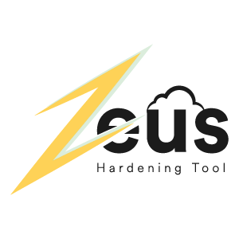

</img>

</a>

# Zeus
AWS Auditing &amp; Hardening Tool

Zeus is a powerful tool for AWS EC2 / S3 / CloudTrail / CloudWatch / KMS best hardening practices. It checks security settings according to the profiles the user creates and changes them to recommended settings based on the CIS AWS Benchmark source at request of the user.

~~Currently, it only includes the Logging mechanism.~~

## Identity and Access Management
- Avoid the use of the "root" account
- Ensure multi-factor authentication (MFA) is enabled for all IAM users that have a console password
- Ensure credentials unused for 90 days or greater are disabled
- Ensure access keys are rotated every 90 days or less
- Ensure IAM password policy requires at least one uppercase letter
- Ensure IAM password policy requires at least one lowercase letter
- Ensure IAM password policy requires at least one symbol
- Ensure IAM password policy requires at least one number
- Ensure IAM password policy requires minimum length of 14 or greater
- Ensure no root account access key exists
- Ensure MFA is enabled for the "root" account
- Ensure security questions are registered in the AWS account 
- Ensure IAM policies are attached only to groups or role
- Enable detailed billing
- Maintain current contact details
- Ensure security contact information is registered
- Ensure IAM instance roles are used for AWS resource access from instances

## Logging
- Ensure CloudTrail is enabled in all regions
- Ensure CloudTrail log file validation is enabled
- Ensure the S3 bucket CloudTrail logs to is not publicly accessible
- Ensure CloudTrail trails are integrated with CloudWatch Logs
- Ensure AWS Config is enabled in all regions
- Ensure S3 bucket access logging is enabled on the CloudTrail S3 bucket
- Ensure CloudTrail logs are encrypted at rest using KMS CMKs
- Ensure rotation for customer created CMKs is enabled

## Networking
- Ensure no security groups allow ingress from 0.0.0.0/0 to port 22
- Ensure no security groups allow ingress from 0.0.0.0/0 to port 3389
- Ensure VPC flow logging is enabled in all VPC
- Ensure the default security group of every VPC restricts all traffic

## Monitoring
 - Ensure a log metric filter and alarm exist for unauthorized API calls
 - Ensure a log metric filter and alarm exist for Management Consolesign-in without MFA
 - Ensure a log metric filter and alarm exist for usage of "root" account
 - Ensure a log metric filter and alarm exist for IAM policy changes
 - Ensure a log metric filter and alarm exist for CloudTrail configuration changes
 - Ensure a log metric filter and alarm exist for AWS Management Console authentication failures
 - Ensure a log metric filter and alarm exist for disabling or scheduled deletion of customer created CMKs
 - Ensure a log metric filter and alarm exist for S3 bucket policy changes
 - Ensure a log metric filter and alarm exist for AWS Config configuration changes
 - Ensure a log metric filter and alarm exist for security group changes
 - Ensure a log metric filter and alarm exist for changes to NetworkAccess Control Lists (NACL)
 - Ensure a log metric filter and alarm exist for changes to network gateways
 - Ensure a log metric filter and alarm exist for route table changes
 - Ensure a log metric filter and alarm exist for VPC changes

### ChangeLog

Soon.

# Requirements

Zeus has been written in bash script using AWS-CLI and it works in Linux/UNIX and OSX.

~~Make sure that the AWS-CLI tool is installed on the system and profile is configured (aws configure).~~

### Update:

pip & aws-cli checking functions are added that based on operating system.

# Usage

git clone https://github.com/DenizParlak/Zeus.git && cd Zeus && chmod +x zeus.sh && ./zeus.sh
